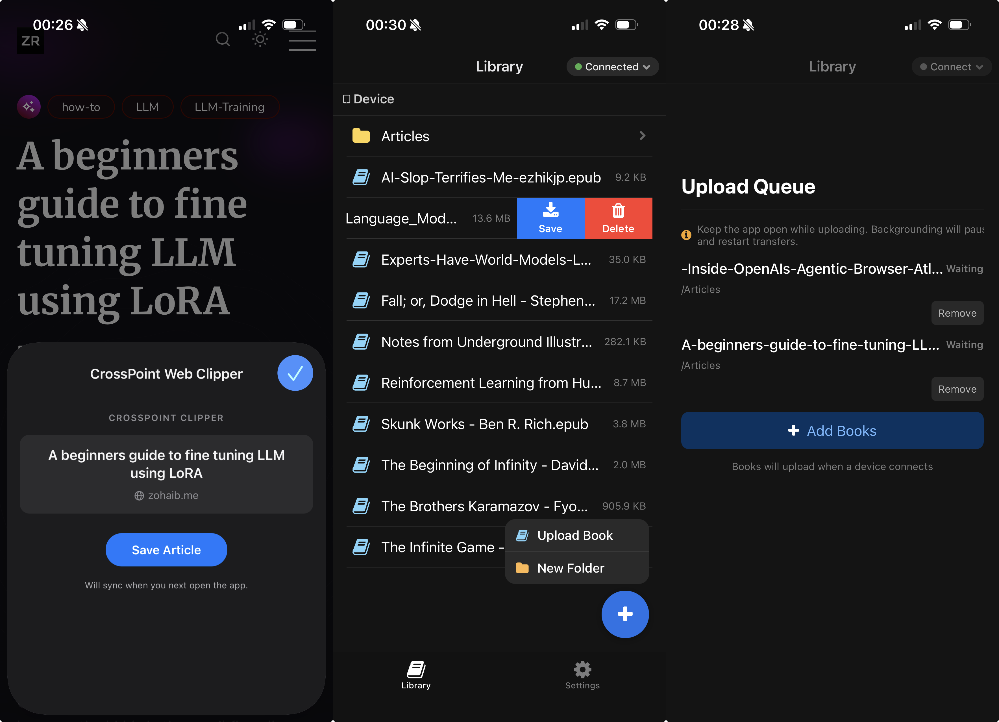

# CrossPoint Sync

Book syncing app for the [XTEink X4](https://xteink.com) e-ink reader. Discovers devices on your local WiFi, browses files on the device, and uploads EPUBs via WebSocket.



## Features

- **Device Discovery** — Automatically finds your XTEink X4 on the local network via UDP broadcast, or connect manually by IP address
- **File Browser** — Browse, create folders, and manage files directly on your e-ink reader
- **Book Uploads** — Pick EPUBs from your phone and upload them over WebSocket with progress tracking
- **Upload Queue** — Queue multiple uploads, retry failures, and track progress for each job
- **Format Preferences** — Configure preferred upload format and destination path on the device
- **Safari Web Clipper** — Clip web articles from Safari, automatically converted to EPUB and synced to your device

## Tech Stack

- **Expo SDK 54** / React Native 0.81 / TypeScript
- **Tamagui** v2 for UI components
- **expo-router** v6 with tab-based navigation
- **Zustand** for state management (persisted via AsyncStorage)
- **react-native-udp** for UDP device discovery

Primary target: **iOS**

## Prerequisites

- **Node.js** 20 or >= 22 (v21.x triggers EBADENGINE warnings for some dependencies)
- **Xcode** with iOS simulator or a physical iOS device
- An XTEink X4 e-ink reader on the same local network (for full functionality)

## Getting Started

```bash
# Install dependencies
npm install

# Build and run on iOS (required for native UDP module)
npx expo run:ios
```

> **Note:** This app uses `react-native-udp`, which requires a native dev build. Device discovery will not work with Expo Go.

## Development

```bash
# Start the Expo dev server (after initial build)
npm start

# Build and run on iOS simulator
npx expo run:ios

# Build and run on a physical iOS device
npx expo run:ios --device

# Test Metro bundling
npx expo export --platform ios
```

### Running on a Physical Device

This app uses native modules (`react-native-udp`, App Group path, Share Extension, Safari Web Extension) that require a dev build — **Expo Go will not work**.

1. Connect your iPhone via USB (or ensure it's on the same Wi-Fi for wireless debugging)
2. Open `ios/CrossPointSync.xcworkspace` in Xcode
3. Select the **CrossPointSync**, **CrossPointSyncShareExtension**, and **CrossPointSyncWebExtension** targets, go to **Signing & Capabilities**, and select your Apple Developer team
4. In Xcode **Build Settings**, search for `ENABLE_USER_SCRIPT_SANDBOXING` and set it to **No** (Xcode 16+ enables this by default, which blocks React Native's bundle script)
5. Run `npx expo run:ios --device` and select your device from the list

> After the initial device build, you can iterate with just `npm start` — the dev client on your phone will connect to Metro automatically.

## Project Structure

```
app/
  _layout.tsx              # Root layout: TamaguiProvider, queue processor, status polling
  (tabs)/
    _layout.tsx            # Tab bar config (Library, Sync, Settings)
    index.tsx              # Library — file browser on connected device
    sync.tsx               # Sync — device discovery/connection + upload queue
    settings.tsx           # Settings — format prefs, device info, data management
  modal.tsx                # About modal
components/                # Reusable UI components
services/                  # Device API, UDP discovery, WebSocket upload, queue processor, EPUB generator
stores/                    # Zustand stores for device, upload, and settings state
hooks/                     # Custom hooks for discovery, status polling, file browsing, document picking
types/                     # TypeScript type definitions
constants/                 # Protocol config (ports, chunk size, timeouts) and theme colors
plugins/                   # Expo config plugins for Share Extension and Safari Web Extension
extension-src/             # Safari Web Extension source (content script, popup, background)
```

## How It Works

CrossPoint Sync communicates with the XTEink X4 using three protocols:

1. **UDP Discovery** (port 8134) — Broadcasts a `hello` message on the local network and listens for the device's response
2. **HTTP REST API** (port 80) — Fetches device status, lists files, creates/deletes folders, and downloads files
3. **WebSocket Upload** (port 81) — Streams books to the device in 64KB binary chunks with progress reporting

## Safari Web Clipper

The Safari Web Clipper extension lets you save web articles directly to your e-ink device as EPUBs.

### How it works

1. Tap the extension icon in Safari on any article
2. The extension extracts the article content (using [Defuddle](https://github.com/nicepkg/defuddle)) and sanitizes it (using [DOMPurify](https://github.com/cure53/DOMPurify))
3. Tap "Send to CrossPoint" — the extension downloads article images and passes everything to the native handler
4. The main app picks it up, generates an EPUB with e-ink optimized styling, and adds it to the upload queue
5. Connect to your device and the article syncs automatically

### Enabling the extension

After building and installing the app:

1. Go to **iOS Settings → Safari → Extensions**
2. Find **CrossPoint Web Clipper** and enable it
3. Tap **All Websites** and choose **Allow**

### Rebuilding after changes

The extension source lives in `extension-src/`. After editing these files, you need to regenerate the native project:

```bash
npx expo prebuild --clean
npx expo run:ios --device
```

The content script (`content.js`) is bundled via esbuild at prebuild time — `defuddle` and `dompurify` are combined into a single file for the extension.

## Disclaimer

This project is not affiliated with [CrossPoint Reader](https://github.com/crosspoint-reader/crosspoint-reader). It was built as a companion app inspired by that project.

## License

Private
