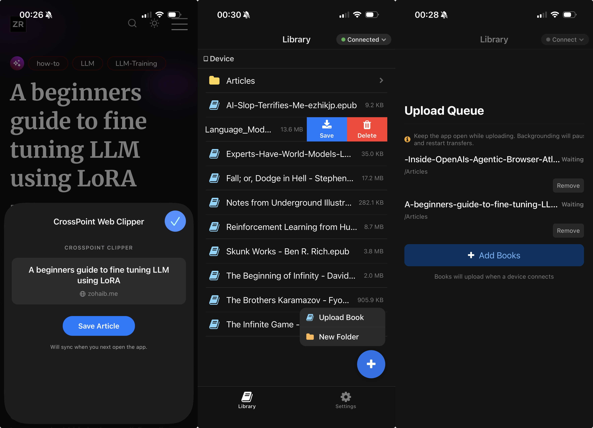

# CrossPoint Sync

Book syncing app for the [XTEink X4](https://xteink.com) e-ink reader. Discovers devices on your local WiFi, browses files on the device, and uploads EPUBs via WebSocket.



## Features

- **Device Discovery** — Automatically finds your XTEink X4 on the local network via UDP broadcast, or connect manually by IP address
- **File Browser** — Browse, create folders, and manage files directly on your e-ink reader
- **Book Uploads** — Pick EPUBs from your phone and upload them over WebSocket with progress tracking
- **Upload Queue** — Queue multiple uploads, retry failures, and track progress for each job
- **Format Preferences** — Configure preferred upload format and destination path on the device
- **Safari Web Clipper** — Clip web articles from Safari, automatically converted to EPUB and synced to your device

## Tech Stack

- **Expo SDK 54** / React Native 0.81 / TypeScript
- **Tamagui** v2 for UI components
- **expo-router** v6 with tab-based navigation
- **Zustand** for state management (persisted via AsyncStorage)
- **react-native-udp** for UDP device discovery

Targets: **iOS and Android**

## Prerequisites

- **Node.js** >= 22 (an LTS release is recommended)
- **iOS:** macOS, Xcode with an iOS simulator, and CocoaPods
- **Android:** Java 17 and Android Studio or the Android command-line SDK. Install platform tools, Android SDK Platform 36, Build Tools 36.0.0, NDK 27.1.12297006, and CMake 3.22.1. An emulator also needs the emulator package and a system image.
- An XTEink X4 e-ink reader on the same local network (for full functionality)

## Getting Started

```bash
# Make Homebrew's Node/npm available on macOS, if necessary
export PATH="/opt/homebrew/bin:$PATH"

# Install the locked dependencies
npm ci

# Generate both native projects and install iOS pods
npm run prebuild

# Build and run on iOS (required for native UDP module)
npm run ios

# Build and run on a connected Android phone or running emulator
npm run android
```

> **Note:** This app includes Expo's development client and native modules. Use the native development builds; Expo Go cannot run the app's native functionality.

The npm development/build commands use `scripts/with-dev-env.sh` to select Java 17 and locate the Android SDK. They respect an explicit `ANDROID_HOME`, otherwise use `.local/android-sdk` or `~/Library/Android/sdk`. Local SDKs, emulator data, Gradle caches, and build products stay in the ignored `.local/` directory. In Android Studio, select the same SDK directory in SDK Manager.

For the project-local emulator created during setup:

```bash
bash scripts/with-dev-env.sh emulator -avd CrossPointSync_API_36
npm run android
```

On another machine, create an AVD in Android Studio and start it before running `npm run android`. To use existing AVDs with the command-line wrapper, set `ANDROID_AVD_HOME` to their directory (usually `~/.android/avd`).

## Development

```bash
# Start the Expo dev server (after initial build)
npm start

# Build and run on iOS simulator
npm run ios

# Build and run on a physical iOS device
npm run ios -- --device

# Build and run on Android
npm run android

# Run the basic EPUB and mock-device protocol tests
npm run test:basic

# Test production Metro bundling on both platforms
npm run check:bundles

# Inspect TypeScript diagnostics
npm run typecheck
```

Metro uses its built-in file watcher by default to avoid a Watchman startup hang on this machine. Set `CROSSPOINT_USE_WATCHMAN=1` to opt into a configured Watchman installation.

The Tamagui v2 RC currently produces known TypeScript diagnostics for style/animation props; `typecheck` is not yet a clean check. Expo Doctor also flags the existing `react-native-udp` package as unmaintained and cannot look up the three project-local native modules. Keep these separate from native build and bundle results.

### Generating Android builds

```bash
# Standalone APK with the JavaScript bundle included (no Metro required)
npm run build:android:apk

# Android App Bundle
npm run build:android:aab
```

Artifacts are copied to `builds/crosspoint-sync-<app-version>.apk` or `.aab`. These local release builds use Expo's generated development signing key. For Google Play distribution, use the production EAS build described in `docs/RELEASING.md` with the app's upload credentials. Native projects are generated and ignored; run `npm run prebuild` again after changing native dependencies or config plugins.

### Running on a Physical Device

This app uses native modules (`react-native-udp`, App Group path, Share Extension, Safari Web Extension) that require a dev build — **Expo Go will not work**.

1. Connect your iPhone via USB (or ensure it's on the same Wi-Fi for wireless debugging)
2. Open `ios/CrossPointSync.xcworkspace` in Xcode
3. Select the **CrossPointSync**, **CrossPointSyncShareExtension**, and **CrossPointSyncWebExtension** targets, go to **Signing & Capabilities**, and select your Apple Developer team
4. In Xcode **Build Settings**, search for `ENABLE_USER_SCRIPT_SANDBOXING` and set it to **No** (Xcode 16+ enables this by default, which blocks React Native's bundle script)
5. Run `npm run ios -- --device` and select your device from the list

> After the initial device build, you can iterate with just `npm start` — the dev client on your phone will connect to Metro automatically.

## Project Structure

```
app/
  _layout.tsx              # Root layout: TamaguiProvider, queue processor, status polling
  (tabs)/
    _layout.tsx            # Tab bar config (Library, Sync, Settings)
    index.tsx              # Library — file browser on connected device
    sync.tsx               # Sync — device discovery/connection + upload queue
    settings.tsx           # Settings — format prefs, device info, data management
  modal.tsx                # About modal
components/                # Reusable UI components
services/                  # Device API, UDP discovery, WebSocket upload, queue processor, EPUB generator
stores/                    # Zustand stores for device, upload, and settings state
hooks/                     # Custom hooks for discovery, status polling, file browsing, document picking
types/                     # TypeScript type definitions
constants/                 # Protocol config (ports, chunk size, timeouts) and theme colors
plugins/                   # Expo config plugins for Share Extension and Safari Web Extension
extension-src/             # Safari Web Extension source (content script, popup, background)
```

## Testing with the Mock Server

You can test the app in the iOS simulator without a physical XTEink device using the built-in mock server.

1. Start the mock server in one terminal:

```bash
npm run mock-device
```

2. Run the app in the simulator:

```bash
npm run ios
```

3. Open the connection sheet, enter `localhost:8082` on the iOS simulator or `10.0.2.2:8082` on the Android emulator, and tap **Connect**. A physical phone needs your computer's LAN IP with port `8082`.

The mock server runs on HTTP port 8082 and WebSocket port 8083 (macOS requires root for the standard ports 80/81). The app parses the `host:port` format automatically and derives the WebSocket port as `httpPort + 1`.

The mock server provides a fake file system with sample books, so you can test file browsing, uploads, and the full connection lifecycle.

### Android visual tests

Install Maestro 2.10 or newer, start an Android emulator, and install the APK. Keep `npm run mock-device` running, then run:

```bash
npm run test:visual:android

# Retry a specific flow
npm run test:visual:android -- .maestro/flows/08-settings-screen.yaml
```

Android visual testing on this emulator used Maestro 2.10.0. The local environment wrapper prefers that version when installed; set `MAESTRO_BINARY` to select a different executable.

The runner connects to the mock reader through the Android emulator's host address (`10.0.2.2:8082`) and uses Gboard's English virtual keys for address entry. It runs the numbered flows in order, starting a separate Maestro session for each flow to avoid driver transport failures between flows. Screenshots, per-flow logs, and a combined JUnit report are saved under `test-screenshots/android/<timestamp>/`. Set `ANDROID_SERIAL` when multiple emulators are connected. App Store marketing captures are excluded.

These tests check navigation and UI assertions and capture images for review. Automated image comparison also requires approved Android reference images and `ANTHROPIC_API_KEY`; the existing reference images and judge specs currently target iOS.

## How It Works

CrossPoint Sync communicates with the XTEink X4 using two protocols:

1. **HTTP REST API** (port 80) — Fetches device status, lists files, creates/deletes folders, and downloads files
2. **WebSocket Upload** (port 81) — Streams books to the device in 64KB binary chunks with progress reporting

## Safari Web Clipper

The Safari Web Clipper extension lets you save web articles directly to your e-ink device as EPUBs.

### How it works

1. Tap the extension icon in Safari on any article
2. The extension extracts the article content (using [Defuddle](https://github.com/nicepkg/defuddle)) and sanitizes it (using [DOMPurify](https://github.com/cure53/DOMPurify))
3. Tap "Send to CrossPoint" — the extension downloads article images and passes everything to the native handler
4. The main app picks it up, generates an EPUB with e-ink optimized styling, and adds it to the upload queue
5. Connect to your device and the article syncs automatically

### Enabling the extension

After building and installing the app:

1. Go to **iOS Settings → Safari → Extensions**
2. Find **CrossPoint Web Clipper** and enable it
3. Tap **All Websites** and choose **Allow**

### Rebuilding after changes

The extension source lives in `extension-src/`. After editing these files, you need to regenerate the native project:

```bash
npm run prebuild -- --platform ios --clean
npm run ios -- --device
```

The content script (`content.js`) is bundled via esbuild at prebuild time — `defuddle` and `dompurify` are combined into a single file for the extension.

## Disclaimer

This project is not affiliated with [CrossPoint Reader](https://github.com/crosspoint-reader/crosspoint-reader). It was built as a companion app inspired by that project.

## License

Private
